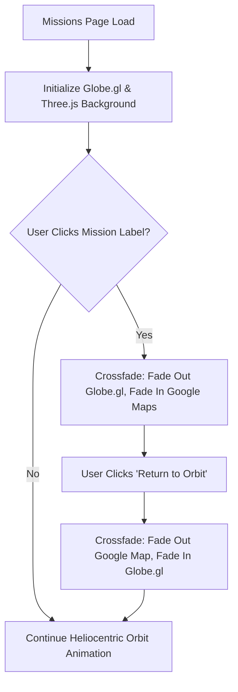

# Technical Documentation: KANI Global Footprint Map System

This document outlines the step-by-step architecture, data pipeline, and rendering systems that generate the interactive 3D Global Footprint map on the KANI Missions page.

---

## 1. Dual-Layer Cinematic Architecture

The map area uses a **Dual-Layer Crossfade Architecture** designed to transition seamlessly between macro space visuals (orbital view) and micro ground details (street view/hybrid map):



1. **Orbital (Globe) Layer (`#globeViz`)**: An interactive 3D Earth utilizing `globe.gl` overlaid on a custom Three.js celestial background. This layer is fully transparent so the deep space background shines through.
2. **Ground (Map) Layer (`#googleMapViz`)**: A Google Maps Hybrid canvas.
3. **Crossfade Mechanism**: Handled programmatically via CSS transition opacities and `pointer-events` toggles to keep the UI interactive and performant:
   - `crossfadeToMap(lat, lng)`: Hides Globe layer (opacity 0, pointer-events none), reveals Google Maps layer (opacity 1, pointer-events auto), positions and zooms Google Maps to the event location, and shows the "Return to Orbit" button.
   - `crossfadeToOrbit()`: Hides Google Maps layer, reveals Globe layer, and hides the "Return to Orbit" button.

---

## 2. Step-by-Step Data Pipeline

When the missions page loads, the following sequential operations occur within the `initMissionsMap()` function:

### Step 2.1: Fetch Google Maps Configuration
- Fetches credentials asynchronously from the server config endpoint `/api/config`.
- If a Google Maps API Key is available, it dynamically appends the Google Maps script:
  ```javascript
  const script = document.createElement('script');
  script.src = `https://maps.googleapis.com/maps/api/js?key=${googleMapsKey}&callback=initGoogleMap`;
  document.head.appendChild(script);
  ```

### Step 2.2: Retrieve Mission Coordinates
- Queries `/api/events?all_dates=true` to fetch active missions and events.
- Filters and structures events containing valid latitudes and longitudes into a label dataset:
  ```json
  [
    { "lat": -1.286389, "lng": 36.817223, "size": 0.4, "color": "#d4a017", "title": "KANI HQ (Nairobi)" }
  ]
  ```

### Step 2.3: Initialize Google Maps Fallback
- Mounts a 2D hybrid street/satellite map onto `#googleMapViz` centered at `(0,0)`.
- Plots markers for all mission locations. Clicking a marker centers and zooms in on that location.

### Step 2.4: Mount Globe.gl
- Mounts the interactive Earth on `#globeViz`.
- Sets night-sky atmosphere, earth texture, and binds the mission coordinates as interactive label objects.
- Registers the click handler:
  ```javascript
  .onLabelClick((label) => {
      crossfadeToMap(label.lat, label.lng);
  });
  ```

---

## 3. Custom Three.js Astronomical Render System

Once `globe.gl` mounts, it instantiates an underlying Three.js scene, camera, and renderer. We retrieve these context objects (`GlobeObj.scene()`, `GlobeObj.camera()`) to inject our heliocentric environment.

### Step 3.1: Camera Adjustment
Because background objects are placed thousands of units away, the default camera clipping plane is updated:
```javascript
camera.far = 100000;
camera.updateProjectionMatrix();
```

### Step 3.2: 2K Texture Loading (CORS Protection)
To avoid WebGL cross-origin image blockages (which cause the browser to render objects as solid gray), **all textures are served locally** from `public/assets/textures/`. 

The textures include:
- `2k_sun.jpg`
- `2k_mercury.jpg`
- `2k_venus_atmosphere.jpg`
- `2k_mars.jpg`
- `2k_jupiter.jpg`
- `2k_saturn.jpg` & `2k_saturn_ring_alpha.png`
- `2k_uranus.jpg`
- `2k_neptune.jpg`

---

## 4. Celestial Elements & Configurations

### 4.1 The Sun (Stationary Anchor)
- **Geometry**: Sphere (`Radius: 800`)
- **Position**: `(-4000, 500, -3000)` (Deep background to create foreground parallax with Earth)
- **Lighting**: Injects a massive `THREE.PointLight(0xffffff, 150000, 0)` from the Sun's core to illuminate all orbiting planets.

### 4.2 Planets, Rings, and Scale Hierarchy
The scale hierarchy balances visual visibility against physical realism (since Earth is fixed at radius `100` by the Globe API):

| Celestial Body | Radius | Orbit Radius | Speed Multiplier | Custom Features |
| :--- | :---: | :---: | :---: | :--- |
| **Sun** | `800` | — | — | PointLight Source |
| **Mercury** | `25` | `1100` | `3.5` | Rocky textures |
| **Venus** | `60` | `1700` | `2.2` | Dense cloud atmosphere |
| **Mars** | `45` | `2500` | `1.3` | Rusty red surface |
| **Jupiter** | `180` | `3800` | `0.65` | Storm bands |
| **Saturn** | `150` | `5400` | `0.35` | Planetary Rings (tilted 20°) |
| **Uranus** | `80` | `7200` | `0.18` | Vertical Rings (tilted 98°) |
| **Neptune** | `75` | `8800` | `0.08` | Deep blue gas giant |

### 4.3 The Asteroid Belt
- Placed between the orbits of Mars (`2500`) and Jupiter (`3800`).
- Consists of a custom `THREE.Points` system containing `1,500` individual particles scattered radially between `2800` and `3300` units, fanning out horizontally with minor Y-axis noise.
- To optimize performance, the entire belt is bound to the Sun's position and rotated as a single group in the animation loop.

### 4.4 Cinematic Meteors (Shooting Stars)
- Formed by a pool of `8` line meshes with a tail length of `120` units, set with a glowing emissive material.
- An animated queue handles random spawning.
- When active, a meteor spawns in a wide bounding box in the scene foreground/midground, looks toward a standardized descent vector `(-0.7, -0.5, -0.5)`, zips across space at high speed (`35-60` units/frame), fades out, and resets with a random delay.

---

## 5. Animation Loop Logic

The animation loop operates inside `requestAnimationFrame(animateSolarSystem)`:
1. **Axial Spin**: Increments the `rotation.y` of the Sun and all 8 planets to show realistic axial rotation.
2. **Heliocentric Orbits**: Calculates positions relative to the Sun (`sunX`, `sunY`, `sunZ`) using polar coordinates:
   ```javascript
   planet.position.x = sunX + Math.cos(time * speedFactor + offset) * orbitRadius;
   planet.position.z = sunZ + Math.sin(time * speedFactor + offset) * orbitRadius;
   planet.position.y = sunY + Math.sin(time * speedFactor + offset) * inclination;
   ```
3. **Asteroid & Star Rotation**: Rotates the parent particle groups around the Sun.
4. **Meteor Zipping**: Iterates through active shooting stars, updating positions, decrementing life span, and handling resets.

---

## 6. Development & Maintenance Reference

- **CDN Script Stability**: Keep dependencies locked to `three@0.150.0` and `globe.gl@2.30.0` inside `public/missions.html` to prevent rendering conflicts.
- **Downloading Textures**: If textures need to be re-downloaded, update and run:
  ```bash
  node download_textures.js
  ```
- **Caching Bypass**: When testing changes to the Three.js or Globe configurations in the browser, always append a fresh query parameter (e.g. `?fresh=X`) to bypass aggressive browser asset caching.
